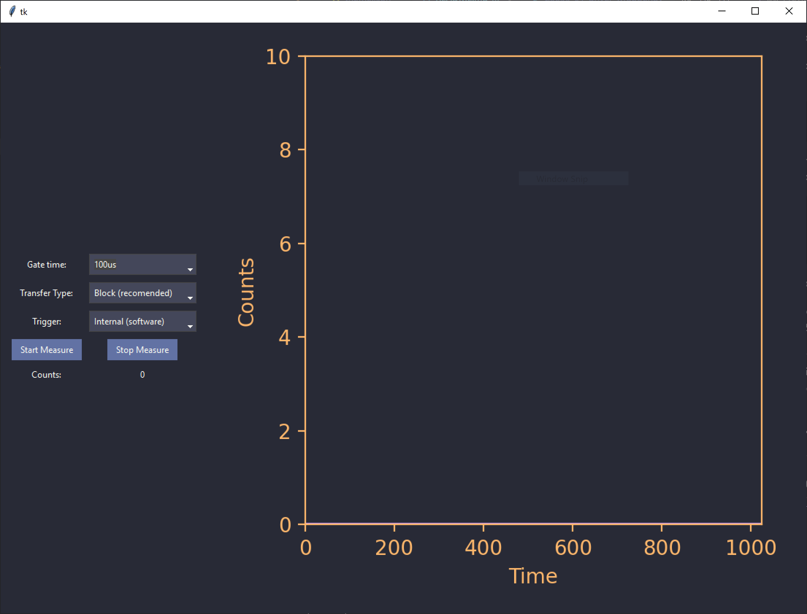

# C8855-PhotonCounter
A Python library for interfacing with a Hamamatsu c8855-01 photon counting unit.

This repository provides a Python wrapper for the Hamamatsu c8855-01 photon counting unit. It also contains a GUI that is similar to the Labview Runtime GUI provided by Hamamatsu. 

# Use
It is recommended you install the driver using the Hamamatsu-provided CD/USB so that at least the `libusb.dll` is installed so that the driver for the photon counter correctly works. 

For 64-bit Windows, you will have to unpack to compressed 64bit driver provided on the CD/USB 

```
Expand c8855-01api.dl_ c8855-01api-x64.dll
```
This is the name this program expects for the driver, if you want to change its name you can do so in the wrapper file. 

```python
dll_path = os.path.join(os.path.dirname(os.path.abspath(__file__)), 'name_of_your_driver.dll')
```
You should also do this if you are running on a 32-bit device.

From here you can run the wrapper function, this will do a basic connect and read (x5) for some basic troubleshooting of the driver installation. 

Alternatively, you can run the GUI. For these measurements, I would recommend sticking to the block transfer as it seems to be the most stable. I have not been able to get single transfers to work reliably. There does not seem to be much downside to this, at least for my tested use case of lanthanide spectroscopy.

# The GUI
As mentioned, the GUI is inspired by Hamamatsu's LabView GUI. It supports both its internal trigger and an external trigger, all available gates and gate times.

<div align="center">
    
</div>


It runs natively in a dark environment-friendly colour scheme however, you can change this in the `theme.json` file & `matplotlib` styling at the beginning of the script. 


## TODO's
 - Adjust time (x-axis) to reflect the number of gates + gate time
 - Write a connection and diagnostic script