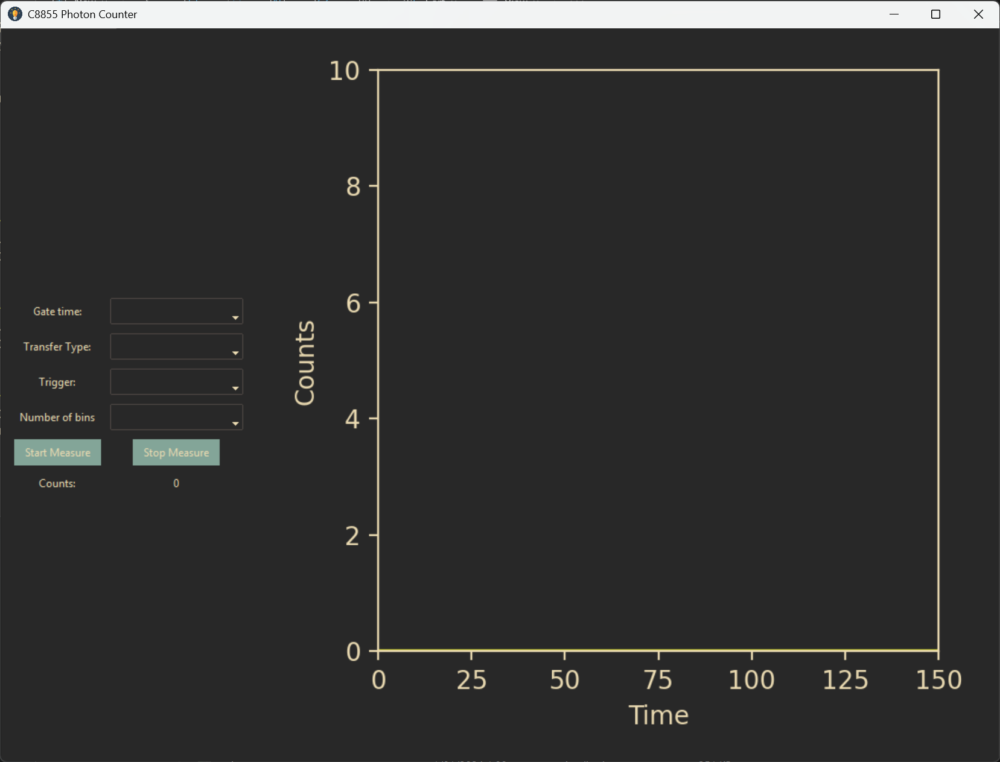

# C8855-Photon Counter
A Python library for interfacing with a Hamamatsu c8855-01 photon counting unit.

This repository provides a Python based GUI for the Hamamatsu c8855-01 photon counting unit, similar to the Labview Runtime GUI provided by Hamamatsu. 

# Use

## Driver install
It is recommended you install the driver using the Hamamatsu-provided CD/USB so that at least the `libusb.dll` is installed so that the driver for the photon counter correctly works. 

For 64-bit Windows, you will have to unpack to compressed 64bit driver provided on the CD/USB 

```
Expand c8855-01api.dl_ c8855-01api-x64.dll
```
This is the name this program expects for the driver, if you want to change its name you can do so in the wrapper file. 

Place this driver either somewhere with an easy to remember path, or note the install path for the driver. 

## GUI install 

make sure you have `rye` installed on your system, then clone this repository. `cd` into the directory for the repository.
Run the following commands:
```shell
rye install c8855-photoncounter --path . -f
```
this will install the photon counter gui and supporting configuration script. 

Run the configuration script:
```shell
configure_dll_c8855 full\path\to\your\dll
```

now you can run the GUI. The gui executable is located in `C:\Users\"your_user_name"\.rye\tools\c8855-photoncounter\Scripts` and a shortcut and icon (if you wish) can be created from here. The executable is called `counter_gui.exe` 


# The GUI
As mentioned, the GUI is inspired by Hamamatsu's LabView GUI. It supports both its internal trigger and an external trigger, all available gates and gate times. It also displays the total number of counts. Improvements to the UI are always welcome.

<div align="center">
    
</div>


It runs natively in a dark environment-friendly colour scheme however, you can change this in the `theme.json` file & `matplotlib` styling at the beginning of the GUI layout. 
